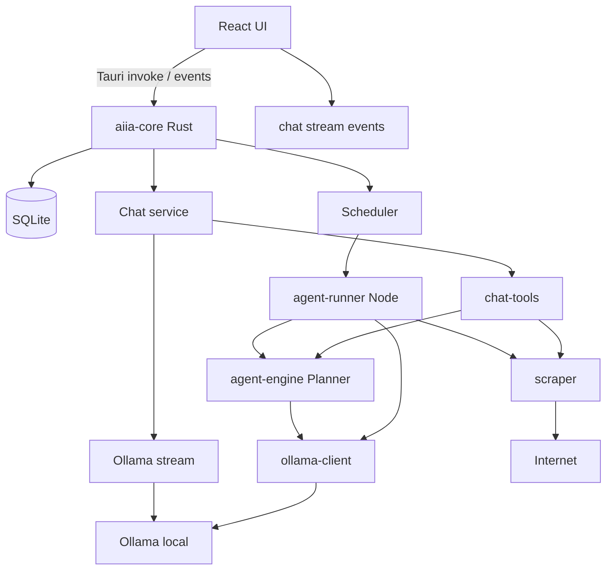

# AIIA — Architecture

## Diagrama de módulos

## Capas

| Capa | Ubicación | Responsabilidad |
|------|-----------|-----------------|
| UI | `apps/desktop/src` | AIIA Chat (home), agentes, inbox, ajustes |
| Tauri commands | `apps/desktop/src-tauri` | Puente UI ↔ Rust core + eventos de stream |
| Core | `crates/aiia-core` | DB, crypto, scheduler, chats, modelos |
| Chat tools | Tauri `chat.rs` + scraper | web_search, fetch_url, create_agent, generate_image (A1111), run_python |
| Agent runner | `packages/agent-runner` | Orquesta ejecución en Node |
| Agent engine | `packages/agent-engine` | Planner, executor, effort, AgentSpec |
| Scraper | `packages/scraper` | DuckDuckGo, Playwright |
| Ollama client | `packages/ollama-client` | HW detect, chat, **chatStream**, model pull |

## Rutas UI

| Ruta | Modo |
|------|------|
| `/`, `/chat/:id` | AIIA Chat |
| `/agents` | Dashboard de agentes |
| `/create`, `/review/:id` | Crear / revisar agente |
| `/inbox`, `/runs`, `/settings` | Igual que antes |

Sidebar estilo ChatGPT: historial de chats + enlaces a Agentes / Inbox / Runs / Ajustes.

## Flujo AIIA Chat
1. Usuario abre `/` → lista chats + hilo activo (o vacío)
2. Mensaje (+ imágenes opcionales) → persistir → Ollama stream (texto o VL según adjuntos)
3. Tools locales: `web_search`, `fetch_url`, `create_agent`, `generate_image` (A1111), `run_python`
4. Contexto largo → `chat_artifacts`; export Markdown bajo `chat-exports/`
5. Archivar / borrar: soft archive o delete cascade

## Flujo de creación de agentes
1. Usuario → prompt (UI create o bridge desde Chat) → PlannerAgent (Ollama) → AgentSpec
2. Preview run (effort: low) → resultados muestra
3. Usuario edita → pending_review → approve → published vN

## Flujo de ejecución de agentes
1. Scheduler detecta agente due → spawn agent-runner
2. Search → Extract → Filter → Dedupe → Store → Export
3. Notificación + inbox update
4. Puede solaparse con una sesión de Chat (sin mutex global de Ollama)

## Almacenamiento
- SQLite en `%APPDATA%/AIIA/aiia.db`
- Clave DB derivada + DPAPI
- Credenciales: tabla `credentials` con blob cifrado
- Chats: tablas `chats`, `chat_messages`, `chat_artifacts`
- Artifacts de chat: ficheros bajo `%APPDATA%/AIIA/chat-artifacts/`

## Distribución
- `landing/` → Render static site
- GitHub Actions → `tauri build` → MSI en Releases
