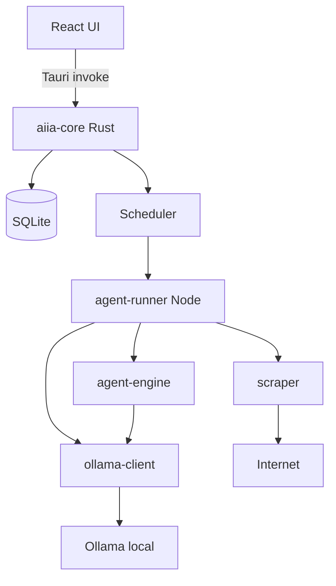

# AIIA — Architecture

## Diagrama de módulos

## Capas

| Capa | Ubicación | Responsabilidad |
|------|-----------|-----------------|
| UI | `apps/desktop/src` | Dashboard, crear agente, inbox, ajustes |
| Tauri commands | `apps/desktop/src-tauri` | Puente UI ↔ Rust core |
| Core | `crates/aiia-core` | DB, crypto, scheduler, modelos |
| Agent runner | `packages/agent-runner` | Orquesta ejecución en Node |
| Agent engine | `packages/agent-engine` | Planner, executor, effort, AgentSpec |
| Scraper | `packages/scraper` | DuckDuckGo, Playwright |
| Ollama client | `packages/ollama-client` | HW detect, chat, model pull |

## Flujo de creación
1. Usuario → prompt → PlannerAgent (Ollama) → AgentSpec
2. Preview run (effort: low) → resultados muestra
3. Usuario edita → pending_review → approve → published vN

## Flujo de ejecución
1. Scheduler detecta agente due → spawn agent-runner
2. Search → Extract → Filter → Dedupe → Store → Export
3. Notificación + inbox update

## Almacenamiento
- SQLite en `%APPDATA%/AIIA/aiia.db`
- Clave DB derivada + DPAPI
- Credenciales: tabla `credentials` con blob cifrado

## Distribución
- `landing/` → Render static site
- GitHub Actions → `tauri build` → MSI en Releases
